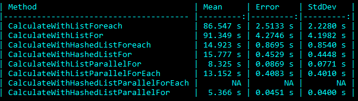

# WordCombiner

## Running the API

To run the WordCombiner API, follow these steps:

1. If starting from the very root folder, navigate to the API folder:

   ```cd WordCombiner.Api```


2. If you are already in the project folder, use the following command:
   
   ```dotnet run WordCombiner.Api.csproj```

   
3. Once the API is running, you can access the Swagger documentation at the following URL:
[https://localhost:7114/swagger/index.html](https://localhost:7114/swagger/index.html)

4. In the Swagger documentation, you will find a POST request that allows you to send a list of words along with the desired length of the combination.

## Running the Console App

To run the WordCombiner Console App, follow these steps:

1. Navigate to the Console folder:

 ```cd WordCombiner.Console```
 
2. If you are already in the project folder, use the following command:

``` dotnet run WordCombiner.Console.csproj```
 
3. When building the Console App, it will ask for the location of the text file. By default, the input file is named "Input.txt."

4. After specifying the input file, you can add the desired length of combinations.

## Benchmark Result for the Handler

For benchmark results, please refer to the reference to a JPG file located in the root folder of the project.


